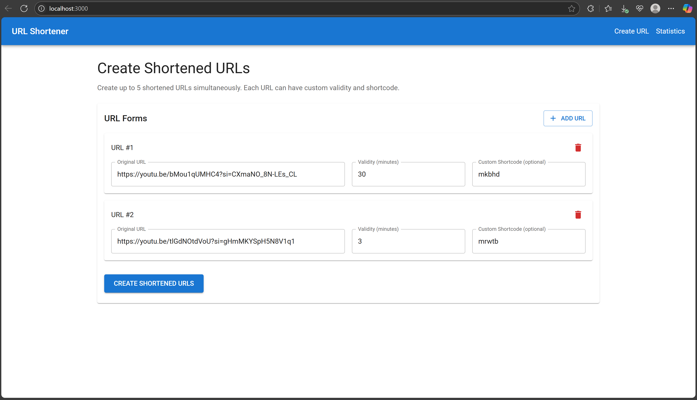
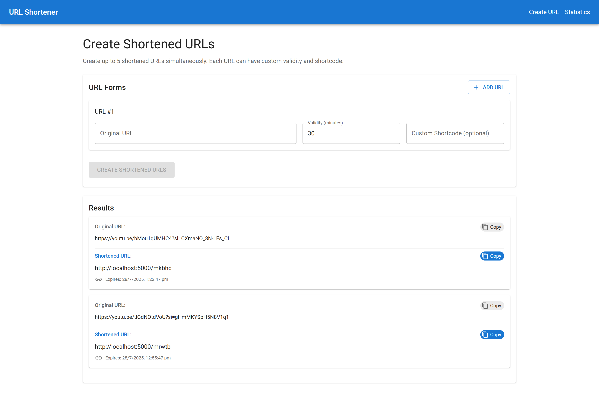
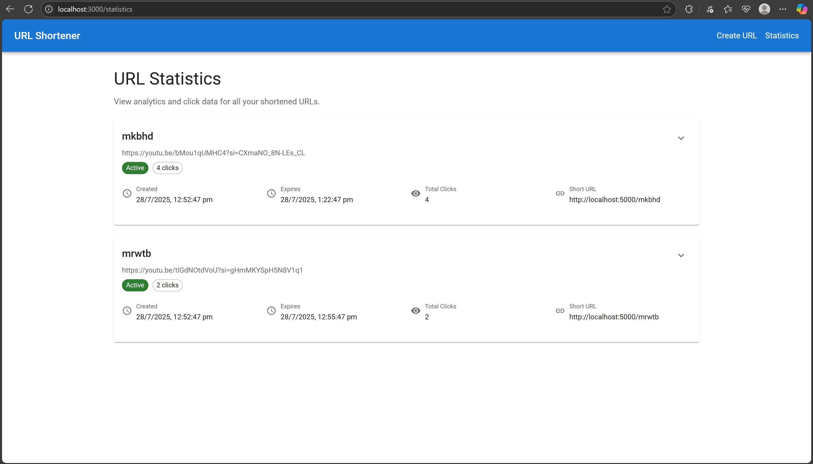
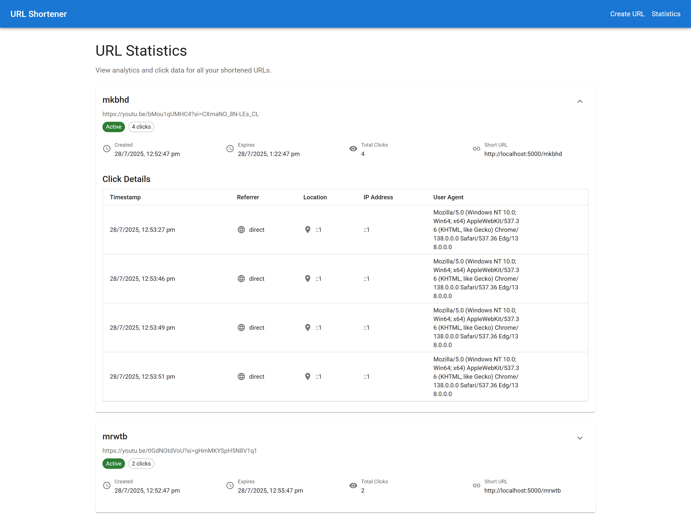
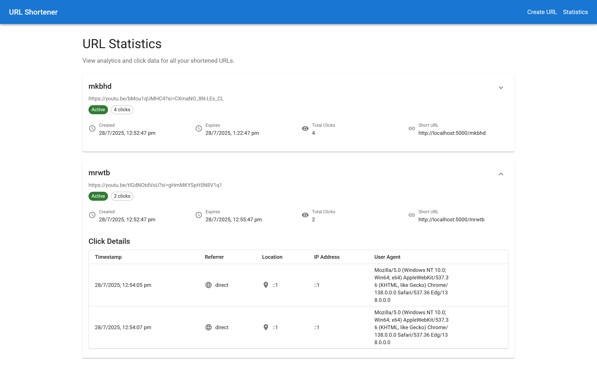

# URL Shortener Full Stack Application

A comprehensive URL shortening service with analytics capabilities, built using Node.js/TypeScript for the backend and React for the frontend.

## Project Structure

```
├── logging-middleware/     # Reusable logging package
├── backend/               # URL Shortener microservice
└── frontend/             # React web application
```

## Features

- **URL Shortening**: Create shortened URLs with custom shortcodes
- **Analytics**: Track clicks, referrers, and geographical data
- **Custom Validity**: Set custom expiration times (default: 30 minutes)
- **Responsive Design**: Mobile and desktop optimized interface
- **Comprehensive Logging**: Production-grade logging middleware

## Tech Stack

- **Backend**: Node.js, TypeScript, Express
- **Frontend**: React, TypeScript, Material-UI
- **Database**: In-memory storage (for demo purposes)
- **Logging**: Custom middleware with external API integration

## Setup Instructions

### Prerequisites
- Node.js (v16 or higher)
- npm or yarn

### Installation

1. **Install Logging Middleware**
   ```bash
   cd Logging Middleware
   npm install
   npm run build
   ```

2. **Setup Backend**
   ```bash
   cd Backend Test Submission
   npm install
   npm run dev
   ```

3. **Setup Frontend**
   ```bash
   cd Frontend Test Submission
   npm install
   npm start
   ```

## API Endpoints

- `POST /shorturls` - Create shortened URL
- `GET /shorturls/:shortcode` - Get URL statistics
- `GET /:shortcode` - Redirect to original URL

## Environment Variables

Create `.env` files in both backend and frontend directories with:
- `PORT`: Server port (default: 5000 for backend, 3000 for frontend)
- `LOG_API_URL`: Logging service URL
- `CLIENT_ID`: Authentication client ID
- `CLIENT_SECRET`: Authentication client secret 


## 📸 Output:

### 1


### 2


### 3


### 4


### 5

